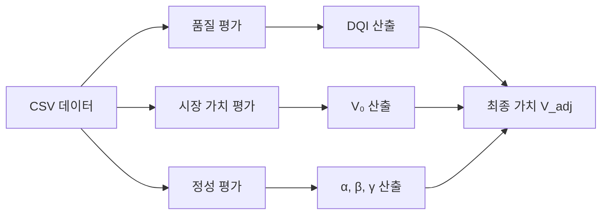

# 데이터 가치 산정 방법론

본 문서는 데이터가치 에이전트의 **데이터 가치 산정 방법**을 상세히 설명합니다.

## 목차
- [개요](#개요)
- [가치 산정 프로세스](#가치-산정-프로세스)
- [1단계: 데이터 품질 평가 (DQI)](#1단계-데이터-품질-평가-dqi)
- [2단계: 시장 가치 평가 (V₀)](#2단계-시장-가치-평가-v₀)
- [3단계: 정성적 평가 (α, β, γ)](#3단계-정성적-평가-α-β-γ)
- [4단계: 최종 가치 산출 (V_adj)](#4단계-최종-가치-산출-v_adj)
- [실행 방법](#실행-방법)

---

## 개요

데이터 가치는 **정량적 평가**와 **정성적 평가**를 결합하여 산정됩니다.

### 최종 가치 산출 공식

```
V_adj = V₀ × (NDQI × α × β × γ)
```

**구성 요소:**
- **V₀**: 시장 가치 (Market Value) - 유사 데이터셋 기반 추정 가격
- **NDQI**: DQI 점수(0~100)를 구간별로 정규화한 품질 보정 계수 (0.8~1.1)
- **α**: 사업성 계수 (Business Value) - 0.8~1.2 범위
- **β**: 권리성 계수 (Rights Value) - 0.8~1.2 범위
- **γ**: 시장성 계수 (Market Value) - 0.8~1.2 범위

---

## 가치 산정 프로세스



---

## 1단계: 데이터 품질 평가 (DQI)

### 평가 항목

데이터 품질은 4가지 차원으로 평가됩니다:

| 차원 | 가중치 | 설명 | 평가 기준 |
|------|--------|------|-----------|
| **Coverage** | 20% | 데이터 완전성 | 행/열 개수, 데이터 밀도 |
| **Quality** | 30% | 데이터 품질 | 결측률, 중복률, 이상치 |
| **Uniqueness** | 20% | 데이터 고유성 | 고유값 비율, 다양성 |
| **Predictive Power** | 30% | 예측력 | 모델 성능 (정확도, R²) |

### 계산 방식

```python
# src/tools/value_eval.py - data_value_score 함수

# 1. Coverage Score (0-100)
coverage = min(100, (rows / 1000) * 50 + (cols / 50) * 50)

# 2. Quality Score (0-100)
quality = 100 - (missing_rate * 100) - (duplicate_rate * 100) - outlier_penalty

# 3. Uniqueness Score (0-100)
uniqueness = avg(unique_ratio per column) * 100

# 4. Predictive Power (0-100)
predictive_power = model_accuracy * 100  # 또는 R² * 100

# 최종 점수
overall_score = (
    coverage * 0.20 +
    quality * 0.30 +
    uniqueness * 0.20 +
    predictive_power * 0.30
)

# 최종 DQI 점수 (0~100)
dqi_score = overall_score

# DQI → NDQI (품질 보정계수) 변환
def dqi_to_ndqi(score):
    if score >= 90:
        return 1.10
    if score >= 80:
        return 1.05
    if score >= 70:
        return 1.00
    if score >= 60:
        return 0.90
    return 0.80

ndqi_weight = dqi_to_ndqi(dqi_score)
```

### 등급 기준

| 등급 | 점수 범위 | 설명 |
|------|-----------|------|
| A (우수) | 85~100 | 매우 높은 품질 |
| B (양호) | 75~84 | 양호한 품질 |
| C (보통) | 65~74 | 보통 품질 |
| D (미흡) | 50~64 | 개선 필요 |
| F (불량) | 0~49 | 대폭 개선 필요 |

### DQI 기반 NDQI 보정계수

| DQI 점수 구간 | 등급 | NDQI (계수) |
|----------------|------|------------------|
| 90점 이상 | A | 1.10 |
| 80~89점 | B | 1.05 |
| 70~79점 | C | 1.00 |
| 60~69점 | D | 0.90 |
| 60점 미만 | E | 0.80 |

---

## 2단계: 시장 가치 평가 (V₀)

### 평가 방법

시장 가치는 **유사 데이터셋 기반 비교 평가**를 통해 산정됩니다.

#### 기술 스택
- **BERT 모델**: `snunlp/KR-BERT-char16424` (한국어 특화)
- **유사도 계산**: Cosine Similarity
- **참조 데이터**: KDX, 국가교통데이터오픈마켓, 해양수산 등

### 계산 프로세스

```python
# src/tools/market_valuation.py - market_value_estimation 함수

# 1. 데이터 텍스트 생성
target_text = f"{dataset_name} {description}"
ref_texts = ref_data['name'] + ' ' + ref_data['description']

# 2. BERT 임베딩 생성
target_embedding = bert_model.encode(target_text)
ref_embeddings = bert_model.encode(ref_texts)

# 3. 코사인 유사도 계산
similarities = cosine_similarity(target_embedding, ref_embeddings)

# 4. 종합 점수 계산 (유사도 + 최신성)
update_weight = calculate_date_weight(ref_data['collect_dt'])
comprehensive_score = similarity * 0.7 + update_weight * 0.3

# 5. 상위 N개 평균 가격
top_n_items = sort_by_score(comprehensive_score)[:5]
V₀ = mean(top_n_items['price'])
```

### 예시

```
타겟 데이터: "유방암 진단 데이터셋"
유사 데이터: "의료 진단 데이터", "암 연구 데이터" 등
→ 유사도 기반 가격 추정: 5,100,000원
```

---

## 3단계: 정성적 평가 (α, β, γ)

### 평가 카테고리

정성적 평가는 **LLM 기반 자동 평가**로 수행됩니다.

| 계수 | 카테고리 | 평가 항목 | 프롬프트 파일 |
|------|----------|-----------|---------------|
| **α** | 사업성 (Business) | 수익성, 활용도, 시장 수요 | `src/prompts/business_evaluation.yaml` |
| **β** | 권리성 (Rights) | 저작권, 개인정보, 법적 리스크 | `src/prompts/rights_evaluation.yaml` |
| **γ** | 시장성 (Market) | 경쟁력, 희소성, 시장 규모 | `src/prompts/market_evaluation.yaml` |

### 등급별 계수

| 등급 | 점수 범위 | 계수 | 설명 |
|------|-----------|------|------|
| A | 90~100 | 1.1 | 탁월/우수 (10% 가산) |
| B | 80~89 | 1.05 | 양호 (5% 가산) |
| C | 70~79 | 1.0 | 보통 (변동 없음) |
| D | 60~69 | 0.9 | 미흡 (10% 감산) |
| E | 0~59 | 0.8 | 불량 (20% 감산) |

### LLM 평가 프로세스

```python
# src/tools/qualitative_evaluation.py

# 1. 메타데이터 로드
metadata = load_json("meta.json")

# 2. 각 카테고리별 평가
for category in ["business", "market", "rights"]:
    # 프롬프트 로드
    prompt = load_yaml(f"src/prompts/{category}_evaluation.yaml")
    
    # LLM 평가 실행
    result = llm.invoke(prompt.format(metadata=metadata))
    
    # 등급 추출 및 계수 변환
    grade = extract_grade(result)  # 예: "A (우수)"
    coefficient = grade_to_coefficient(grade)  # 예: 1.1

# 3. 계수 할당
α = business_coefficient
β = rights_coefficient
γ = market_coefficient
```

---

## 4단계: 최종 가치 산출 (V_adj)

### 통합 계산

```python
# src/presets/modes.py - run_value_assessment 함수

# 1. 각 요소 수집
V₀ = market_value_estimation(...)  # 예: 5,100,000원
DQI_score = data_value_score(...)   # 예: 92.75점
NDQI = dqi_to_ndqi(DQI_score)       # 예: 1.10 (A등급)
α = business_coefficient             # 예: 1.1
β = rights_coefficient               # 예: 1.0
γ = market_coefficient               # 예: 1.05

# 2. 최종 가치 계산
V_adj = V₀ × (NDQI × α × β × γ)
      = 5,100,000 × (1.10 × 1.1 × 1.0 × 1.05)
      = 5,100,000 × 1.271
      = 6,472,100원

# 3. 100원 단위 반올림
V_adj = round(V_adj, -2)  # 6,472,100원
```

### 예시 시나리오

#### 시나리오 1: 고품질 의료 데이터
```
V₀ = 10,000,000원 (유사 데이터 기반)
DQI = 95점  → NDQI = 1.10
α = 1.2 (사업성 S등급)
β = 0.9 (권리성 D등급 - 개인정보 리스크)
γ = 1.1 (시장성 A등급)

V_adj = 10,000,000 × (NDQI 1.10 × 1.2 × 0.9 × 1.1)
      = 10,000,000 × 1.3068
      = 13,068,000원
```

#### 시나리오 2: 저품질 공개 데이터
```
V₀ = 1,000,000원
DQI = 65점  → NDQI = 0.90
α = 0.9 (사업성 D등급)
β = 1.0 (권리성 C등급)
γ = 0.8 (시장성 E등급)

V_adj = 1,000,000 × (NDQI 0.90 × 0.9 × 1.0 × 0.8)
      = 1,000,000 × 0.648
      = 648,000원
```

---

## 실행 방법

### 1. 환경 설정

프로젝트에서 권장하는 방법은 Python의 `venv`로 가상환경을 만들고 `requirements.txt`로 의존성을 설치하는 것입니다.

```bash
# 프로젝트 루트에서 가상환경 생성 (venv 사용)
python3 -m venv .venv
source .venv/bin/activate

# pip 최신화 및 종속성 설치
python -m pip install --upgrade pip
python -m pip install -r requirements.txt

# (권장) Hugging Face tokenizers 병렬성 경고 방지
# 터미널에만 적용하려면 아래를 실행하거나, 프로젝트 루트의 .env에 추가하세요:
# export TOKENIZERS_PARALLELISM=false

# macOS(특히 Apple Silicon)에서 PyTorch 설치가 필요한 경우,
# 공식 설치 가이드를 참고해 환경에 맞는 커맨드를 사용하세요:
# https://pytorch.org/get-started/locally/
```

### 2. 메타데이터 준비

`meta.json` 파일을 생성합니다:

```json
{
  "dataset_name": "유방암 진단 데이터셋",
  "description": "유방암 진단을 위한 의료 영상 특징 데이터",
  "domain": "의료/헬스케어",
  "data_size": "569건",
  "collection_period": "2020-2023",
  "update_frequency": "월 1회",
  "license": "CC BY-NC 4.0",
  "contains_pii": false
}
```

### 3. 가치 평가 실행

```bash
# 전체 가치 평가 (품질 + 시장 + 정성)
python main.py \
  --mode value_assessment \
  --csv breast_cancer_dataset.csv \
  --target diagnosis \
  --ref-data "KDX+국가교통데이터오픈마켓+해양수산_20250806.csv"
```

### 4. 결과 확인

생성된 리포트에서 다음 정보를 확인할 수 있습니다:

```
outputs/report_YYYYMMDD_HHMMSS/
├── report.md          # 전체 분석 리포트 (한글)
├── report.json        # JSON 형식 결과
├── histograms.png     # 데이터 분포 시각화
└── correlation_matrix.png  # 상관관계 행렬
```

#### report.md 주요 섹션

1. **데이터 가치 평가**: DQI 점수 및 등급
2. **최종 가치 산출**: V_adj 계산 결과
   - 산출 공식 및 각 요소 값
   - 정성 평가 상세 (α, β, γ)
   - 최종 보정 가격
3. **비즈니스 시사점**: 실무 활용 방안

---

## 코드 구조

### 핵심 파일

```
src/
├── tools/
│   ├── value_eval.py           # DQI 계산
│   ├── market_valuation.py     # V₀ 계산 (BERT 기반)
│   ├── qualitative_evaluation.py  # α, β, γ 계산 (LLM 기반)
│   └── reporting.py            # 리포트 생성
├── presets/
│   └── modes.py                # run_value_assessment (통합 실행)
└── prompts/
    ├── business_evaluation.yaml
    ├── market_evaluation.yaml
    └── rights_evaluation.yaml
```

### 실행 흐름

```python
# main.py → modes.py → 각 tool 호출

def run_value_assessment(csv_path, target, ref_data):
    # 1. 기본 분석
    load_csv(csv_path)
    quality_report(...)
    
    # 2. 모델링
    train_baseline(...)
    
    # 3. 품질 평가 (DQI)
    dqi_result = data_value_score(...)
    DQI = dqi_result['overall_score'] / 100
    
    # 4. 시장 가치 (V₀)
    market_result = market_value_estimation(ref_data=ref_data)
    V₀ = market_result['estimated_price']
    
    # 5. 정성 평가 (α, β, γ)
    qual_result = qualitative_evaluation(meta_path="meta.json")
    α = qual_result['business']['coefficient']
    β = qual_result['rights']['coefficient']
    γ = qual_result['market']['coefficient']
    
    # 6. 최종 계산
    V_adj = V₀ * (DQI * α * β * γ)
    
    # 7. 리포트 생성
    export_markdown(results, "report.md")
```

---

## 참고 자료

- **BERT 모델**: [snunlp/KR-BERT-char16424](https://huggingface.co/snunlp/KR-BERT-char16424)
- **LangChain**: [공식 문서](https://python.langchain.com/)
- **데이터 품질 평가 기준**: ISO/IEC 25012

---

## 🧪 최종 테스트

### 테스트 명령어

#### 1. 환경 활성화
```bash
conda activate data-value03
```

#### 2. 전체 가치 평가 실행 (권장)
```bash
python main.py \
  --mode value_assessment \
  --csv breast_cancer_dataset.csv \
  --target diagnosis \
  --ref-data "KDX+국가교통데이터오픈마켓+해양수산_20250806.csv"
```

#### 3. 결과 확인
```bash
# 최신 리포트 디렉토리 확인
ls -lt outputs/ | head -5

# 리포트 내용 확인 (최종 가치 산출 섹션 포함)
cat outputs/report_*/report.md | grep -A 30 "최종 가치 산출"
```

---

### 테스트 체크리스트

실행 후 다음 항목들을 확인하세요:

#### ✅ 콘솔 출력 확인
- [ ] 💯 데이터 가치 점수: XX.XX (등급)
- [ ] 💰 시장 추정 가격: X,XXX,XXX원
- [ ] 💰 [최종 가치 산출] 섹션 출력
- [ ] V0 (시장가치), DQI (품질지수), 계수 (α, β, γ) 표시
- [ ] 👉 최종 보정 가치 (V_adj): X,XXX,XXX원

#### ✅ report.md 파일 확인
- [ ] "핵심 요약" 섹션 (한글)
- [ ] "최종 가치 산출 (Value Adjustment)" 섹션 존재
- [ ] 산출 공식 표시: $V_{adj} = V_0 \times (DQI \times \alpha \times \beta \times \gamma)$
- [ ] 산출 결과 테이블 (V₀, DQI, α, β, γ, V_adj)
- [ ] 정성 평가 상세 (사업성, 권리성, 시장성)

---

### 예상 결과

```
============================================================
✅ 분석 완료!
============================================================
📁 리포트 디렉토리: outputs/report_20251119_HHMMSS
💯 데이터 가치 점수: 92.75 (A (우수))
💰 시장 추정 가격: 5,100,000원

  💰 [최종 가치 산출]
  V0 (시장가치): 5,100,000원
  DQI (품질지수): 0.9275
  계수 (α, β, γ): 1.0, 1.0, 1.0
  👉 최종 보정 가치 (V_adj): 4,730,250원
```

---

### ⚠️ 주의사항

#### 첫 실행 시 시간 소요
- **BERT 임베딩 생성**: 참조 데이터가 크기 때문에 최초 실행 시 **5~10분** 소요될 수 있습니다
- 임베딩은 캐시되므로 두 번째 실행부터는 빠릅니다
- 진행 상황: `⏳ [Market Valuation] BERT 모델 로딩 중...` 메시지 확인

#### 정성 평가 (선택사항)
현재 API 키가 없으면 정성 평가가 실패하고 계수가 모두 1.0으로 기본값 적용됩니다.

**정성 평가를 활성화하려면:**
```bash
# .env 파일 생성
echo "OPENAI_API_KEY=your-api-key-here" > .env
echo "LLM_PROVIDER=openai" >> .env
```

또는 Anthropic Claude 사용:
```bash
echo "ANTHROPIC_API_KEY=your-api-key-here" > .env
echo "LLM_PROVIDER=anthropic" >> .env
```

또는 Google Gemini 사용:
```bash
echo "GOOGLE_API_KEY=your-api-key-here" > .env
echo "LLM_PROVIDER=gemini" >> .env
# (선택) 기본/고급 모델명 커스터마이즈
echo "GEMINI_MODEL=gemini-2.0-flash" >> .env
echo "GEMINI_MODEL_ADVANCED=gemini-2.5-flash" >> .env
```

환경변수를 지정하지 않으면 `OPENAI_API_KEY` → `ANTHROPIC_API_KEY` → `GOOGLE_API_KEY` 순으로 존재 여부를 확인해 자동으로 LLM을 선택하며, 키가 하나도 없으면 기본적으로 **Gemini**를 사용합니다. 프로젝트 루트의 `api.env` 템플릿에 여러 키를 함께 보관하면 이 로직을 그대로 활용할 수 있습니다.

---

### 🔧 트러블슈팅

#### 문제 1: `ModuleNotFoundError`
```bash
# 해결: 의존성 재설치
pip install -r requirements.txt
# 또는
pip install langchain langchain-openai transformers torch scikit-learn pandas
```

#### 문제 2: BERT 모델 다운로드 실패
```bash
# 해결: 수동 다운로드
python -c "from transformers import AutoTokenizer, AutoModel; \
AutoTokenizer.from_pretrained('snunlp/KR-BERT-char16424'); \
AutoModel.from_pretrained('snunlp/KR-BERT-char16424')"
```

#### 문제 3: 메모리 부족
```bash
# 해결: 참조 데이터를 작은 샘플로 테스트
head -100 "KDX+국가교통데이터오픈마켓+해양수산_20250806.csv" > sample_ref.csv
python main.py --mode value_assessment --csv breast_cancer_dataset.csv --ref-data sample_ref.csv
```

#### 문제 4: 한글 깨짐
```python
# src/tools/reporting.py 확인
# matplotlib 한글 폰트 설정이 올바른지 확인
plt.rcParams['font.family'] = 'AppleGothic'  # macOS
# 또는
plt.rcParams['font.family'] = 'NanumGothic'  # Windows/Linux
```

---

## 추가 노트 (간단)

- **Tokenizers 병렬성 경고**: Hugging Face의 `tokenizers`가 포크 이후 병렬성으로 인해 데드락 경고를 출력할 수 있습니다. 이를 방지하려면 프로젝트 루트 `.env` 또는 실행 전 환경변수에 아래를 추가하세요:
```
TOKENIZERS_PARALLELISM=false
```
또는 임시로 터미널에서:
```bash
export TOKENIZERS_PARALLELISM=false
```

- **권장 모델**: 정성 평가 등 고급 LLM 호출 시 비용·성능 균형을 위해 `gpt-4o-mini`(또는 사용자가 선호하는 대체 모델)를 권장합니다. `.env` 예시:
```
OPENAI_MODEL_ADVANCED=gpt-4o-mini
```
원치 않으면 설정하지 않아도 됩니다.

- **노트(파일 이동)**: 실험용 노트북 코드는 `notebooks/` 폴더로 이동되었습니다. 실험 스크립트나 긴 예시는 해당 폴더를 확인하세요.

## 문의

데이터 가치 산정 방법에 대한 문의사항은 프로젝트 관리자에게 연락해주세요.
